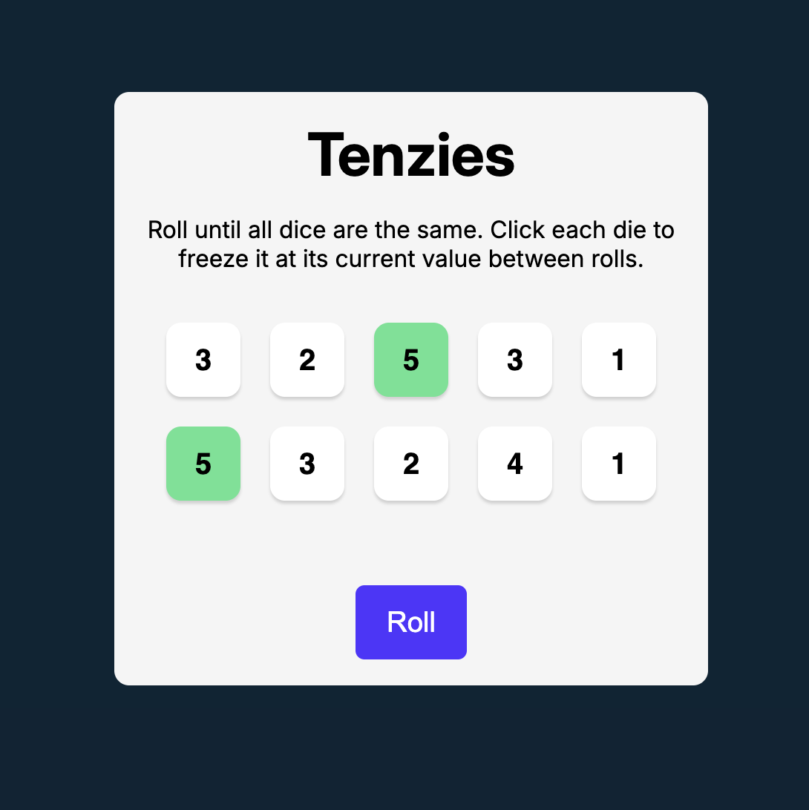

# 🎲 Tenzies


A modern implementation of the classic **Tenzies** dice game built with **React**, **Vite**, and **Vanilla JavaScript**. Hold dice with matching values while rerolling the rest until all ten dice show the same number. The game features a responsive interface, accessibility improvements, and a confetti celebration when you win.

---

## 📸 Preview



---

## 🚀 Live Demo

**Play the game:**
https://yamankadoura.github.io/Capstone-Game/


---
## 🎮 How to Play

1. Click **Roll** to generate random dice values.
2. Click on a die to **hold** its current value.
3. Roll again to reroll only the unheld dice.
4. Continue until all ten dice show the same value.
5. Celebrate your victory and start a **New Game**!

---

## ✨ Features

* 🎲 Roll ten dice
* 📌 Hold individual dice between rolls
* 🎯 Win when all held dice match
* 🎉 Confetti celebration on victory
* 🔄 Start a new game instantly
* ⚡ Random dice generation
* 🆔 Unique dice IDs using Nano ID
* ♿ Keyboard focus and accessibility improvements
* 📱 Responsive design
* 🚀 Fast performance powered by Vite

---

## 🛠 Technologies

* React
* Vite
* JavaScript (ES6+)
* CSS3
* React Hooks (`useState`, `useEffect`, `useRef`)
* Nano ID
* React Confetti

---

## 📂 Project Structure

```text
capstone-game/
│
├── assets/
│   └── screenshot.png
│
├── src/
│   ├── Components/
│   │   └── Die.jsx
│   │
│   ├── App.jsx
│   ├── index.css
│   └── index.jsx
│
├── .github/
│   └── workflows/
│       └── deploy.yaml
│
├── public/
├── .gitignore
├── eslint.config.js
├── index.html
├── package.json
├── package-lock.json
├── README.md
└── vite.config.js
```

---

## 💻 Getting Started

Clone the repository:

```bash
git clone https://github.com/yamankadoura/Capstone-Game.git
```

Navigate into the project:

```bash
cd Capstone-Game
```

Install dependencies:

```bash
npm install
```

Start the development server:

```bash
npm run dev
```

Open your browser and visit:

```text
http://localhost:5173
```
---

## 🚀 Future Improvements

* ⏱️ Timer
* 📊 Roll counter
* 🏆 Best score tracking with Local Storage
* 🔊 Sound effects
* 🌙 Dark / Light mode
* 📈 Statistics dashboard
* 🎲 Difficulty settings

---

## 📄 License

This project is licensed under the MIT License.
